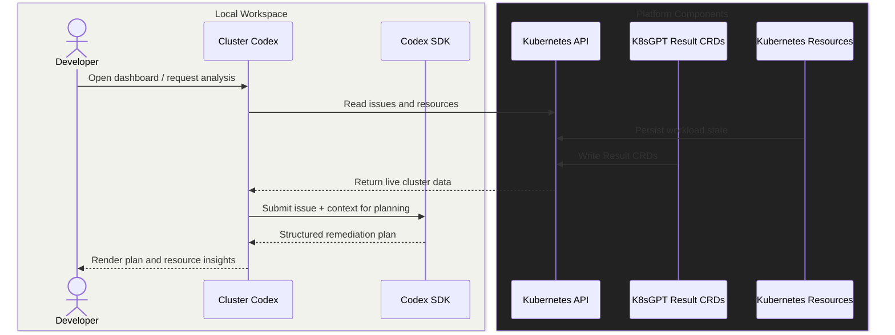

# Developer Documentation

## Product Context

### The Problem

Kubernetes troubleshooting is still high-friction. When workloads fail, teams often bounce between `kubectl`, events, logs, and tribal knowledge to diagnose and recover.

### The Solution

Cluster Codex is a single Next.js application that runs locally against your existing cluster access:

- No separate backend service to deploy
- Codex auth/provider mode is fully environment-driven via `.env`

The app assumes you already have a valid `kubeconfig` and permissions. Kubernetes access is handled inside the app using [`@kubernetes/client-node`](https://github.com/kubernetes-client/javascript), so your own kubeconfig context and RBAC remain the source of truth.

## How It Works



## Features

### Issues Dashboard

- Reads K8sGPT `Result` CRDs directly from Kubernetes APIs.
- Shows affected kind, namespace, name, and detection time.
- Supports dismiss/restore with local browser storage.

### Live Codex Plan Generation

- Uses `@openai/codex-sdk` with structured JSON schema output for consistent plan shape.
- Generates root-cause analysis, mitigation steps, validation checks, and rollback guidance.
- Falls back to deterministic local planning if Codex is unavailable.
- Supports auth modes via env (`chatgpt`, `api`, `auto`).
- Supports local providers (for example Ollama or llama-server) via env configuration.

### Resource Explorer

- Read-only cluster inventory across common resource kinds, including workloads, networking objects, storage objects, CRDs, nodes, and events.

## Technology Stack

| Technology                                                                      | Purpose                                              |
| ------------------------------------------------------------------------------- | ---------------------------------------------------- |
| [Next.js](https://nextjs.org) + [React](https://react.dev)                      | Frontend UI + in-app route handlers                  |
| [Kubernetes Client JavaScript](https://github.com/kubernetes-client/javascript) | Kubernetes API access via kubeconfig                 |
| [Codex SDK](https://developers.openai.com/codex/sdk)                            | Live cluster issue analysis and remediation planning |
| [K8sGPT Operator](https://docs.k8sgpt.ai/getting-started/in-cluster-operator/)  | In-cluster issue detection                           |
| [K3d](https://k3d.io/stable)                                                    | Local Kubernetes cluster                             |
| [Playwright](https://playwright.dev)                                            | E2E testing                                          |

## Local Development Workflow

### Prerequisites

- Node.js 20+
- Docker Engine (for K3d)
- K3d: `brew install k3d`
- Helm: `brew install helm`
- kubectl: `brew install kubectl`

### First Time Setup

```bash
git clone https://github.com/justinthelaw/clustercodex.git
cd clustercodex
npm install
# Ensure optional dependencies are available for Codex CLI binaries:
npm install --include=optional

# Sign in for live Codex planning (OAuth with ChatGPT)
npx codex login --device-auth
```

If you see `Unable to locate Codex CLI binaries`, reinstall Codex CLI with optional deps:

```bash
npm install --include=optional
# or
npm install @openai/codex --include=optional
```

### Daily Development

```bash
# Setup cluster fixtures and run the frontend
npm run dev
```

Open <http://localhost:3000>.

If infrastructure is already running and you only need the app server:

```bash
npm run dev:app
```

### Service URLs

- App: <http://localhost:3000>

### Cluster Access Model

- The app uses `@kubernetes/client-node` from in-app route handlers.
- It reads kubeconfig from:
  - `KUBECONFIG` if set
  - otherwise the default kubeconfig location (for example `~/.kube/config`)
- Optional context override: `KUBE_CONTEXT`
- Live plan generation uses `@openai/codex-sdk`.
- Codex runtime env behavior is loaded from `.env` (`.env.example` provides baseline values).
- Required runtime envs: `CODEX_MODEL`, `CODEX_AUTH_MODE`, `CODEX_LOCAL_PROVIDER`.
- Optional plan safety envs: `CODEX_PLAN_IDLE_TIMEOUT_MS`, `CODEX_PLAN_MAX_TIMEOUT_MS`, `CODEX_PLAN_CONTEXT_MAX_CHARS`.
- API key mode: set `CODEX_AUTH_MODE=api` and `CODEX_API_KEY`.
- Local provider mode examples:
  - `CODEX_LOCAL_PROVIDER=ollama`
  - `CODEX_LOCAL_PROVIDER=llama-server`
  - Required when provider is enabled: `CODEX_LOCAL_BASE_URL`, `CODEX_LOCAL_PROVIDER_ID`, `CODEX_LOCAL_PROVIDER_NAME`, `CODEX_LOCAL_ENV_KEY`
  - Optional: `CODEX_LOCAL_API_KEY`

### Codex Runtime Configuration Examples

```bash
# Provided in `.env.example`
CODEX_MODEL=gpt-5.1-codex-mini
CODEX_AUTH_MODE=chatgpt
# Optional: fail stalled generations, cap absolute runtime, and trim oversized context input
# CODEX_PLAN_IDLE_TIMEOUT_MS=90000
# CODEX_PLAN_MAX_TIMEOUT_MS=300000
# CODEX_PLAN_CONTEXT_MAX_CHARS=12000
```

```bash
# API key mode
CODEX_AUTH_MODE=api
CODEX_API_KEY=sk-...

# Auto mode (use API key if present, otherwise OAuth)
CODEX_AUTH_MODE=auto
```

```bash
# Ollama
CODEX_LOCAL_PROVIDER=ollama
CODEX_LOCAL_BASE_URL=http://localhost:11434/v1
CODEX_LOCAL_PROVIDER_ID=ollama
CODEX_LOCAL_PROVIDER_NAME=Ollama
CODEX_LOCAL_ENV_KEY=OPENAI_API_KEY
CODEX_MODEL=<your-local-model-name>

# llama-server (llama.cpp)
CODEX_LOCAL_PROVIDER=llama-server
CODEX_LOCAL_BASE_URL=http://localhost:8080/v1
CODEX_LOCAL_PROVIDER_ID=llama_server
CODEX_LOCAL_PROVIDER_NAME=llama-server
CODEX_LOCAL_ENV_KEY=OPENAI_API_KEY
CODEX_MODEL=<your-local-model-name>
```

### In-Cluster Resources

- K8sGPT Operator namespace: `k8sgpt-operator-system`
  - Check issue CRDs with: `kubectl get results -n k8sgpt-operator-system`
- Broken deployment: `broken` namespace (`ImagePullBackOff`)
- GPU test deployment: `gpu-test` namespace (`Pending`)
- PodInfo deployment: `default` namespace (`InvalidImageName`)

### Useful Commands

Cleans all dependencies, testing, example cluster and `.env` artifacts:

```bash
npm run clean
```

### Running Tests

```bash
pre-commit run --all-files
npm run build
npm run test
```

For the full local CI-equivalent gate (clean + lint + build + E2E):

```bash
npm run flight-check
```

### Troubleshooting

#### Codex OAuth

If you see:
`Unable to locate Codex CLI binaries. Ensure @openai/codex is installed with optional dependencies.`

run the recovery flow:

```bash
cd ~/dev/clustercodex
rm -rf node_modules
npm install --include=optional

# verify platform package is present
npm ls @openai/codex @openai/codex-linux-x64
node -e "console.log(require.resolve('@openai/codex-linux-x64/package.json'))"

# then auth + run
npx codex login --device-auth
npm run dev
```

If it still fails, check for an environment override:

```bash
echo "$NPM_CONFIG_OMIT"
```

If output includes `optional`, unset it for your shell/session before reinstalling.

## Project Structure

```text
clustercodex/
├── src/               # Next.js application source (root frontend + in-app APIs)
├── tests/             # Playwright end-to-end tests
├── scripts/           # Infrastructure orchestration and E2E runner
├── charts/            # Helm/YAML cluster assets
├── DEVELOPMENT.md     # Local development guide
└── README.md          # Quick-start oriented overview
```

## Additional Project Docs

- Contributing: `docs/CONTRIBUTING.md`
- Security: `docs/SECURITY.md`
- Support: `docs/SUPPORT.md`
- Code of Conduct: `docs/CODE_OF_CONDUCT.md`

## License

This repository currently has no dedicated license file. Add one before broad reuse.
