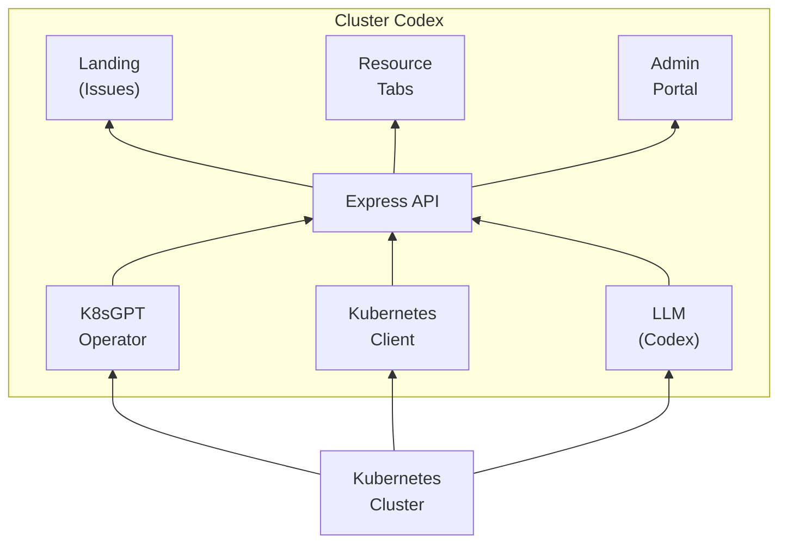

# Cluster Codex

**Your personal platform engineer, without the Jira ticket.**

## The Problem

Kubernetes troubleshooting is painful. When pods crash, deployments fail, or resources misbehave, developers face:

- **Context switching**: Jumping between `kubectl`, logs, events, and dashboards
- **Tribal knowledge**: Solutions live in Slack threads, wikis, or someone's head
- **Reactive firefighting**: Same issues recur because root causes aren't documented
- **Slow resolution**: Finding the right fix takes hours of investigation

## The Solution

Cluster Codex combines **automated issue detection** (via K8sGPT) with **LLM-powered Cluster Codex plans** to give developers actionable guidance in seconds.

### Core Workflow

1. **See** — Kubernetes issues detected automatically by K8sGPT
2. **Understand** — AI-generated analysis explains what's wrong and why
3. **Act** — Step-by-step Cluster Codex plan with `kubectl` commands

## How It Works



1. **K8sGPT Operator** runs in-cluster, detecting issues via Result CRDs
2. **Backend API** fetches Result CRDs, enriching with resource/event context
3. **LLM (Codex)** generates a Cluster Codex plan (action steps + analysis)
4. **Frontend** displays issues and plans with user access filtering

## Features

### Issues Dashboard

View all detected Kubernetes issues:

- Issue title, severity, affected resource, namespace
- K8sGPT-provided context and analysis
- One-click button to generate a combined Codex plan

### Short-term Plans

For immediate fixes that get things working **now**:

- Add optional context ("We just deployed v2", "This started after scaling")
- Receive structured, actionable steps with `kubectl` commands
- Each step includes impact assessment, validation, and rollback instructions

### Long-term Resolution

For preventing the same issue from recurring:

- Root cause hypotheses based on cluster state
- Evidence gathering steps to confirm diagnosis
- Recommendations for code, config, or infrastructure changes

### Resource Visibility

Read-only view of cluster resources:

- **Pods**: Status, restarts, age, node placement
- **Deployments**: Replicas, strategy, conditions
- **Events**: Recent cluster activity

### Admin Portal

Central access control management:

- Namespace allow-lists per user
- Resource kind allow-lists per user
- Rate limits for plan generation

## Technology Stack

### Core (MVP)

| Technology                                                                     | Purpose                        |
| ------------------------------------------------------------------------------ | ------------------------------ |
| [React](https://react.dev) + [Vite](https://vitejs.dev)                        | Frontend UI                    |
| [Express](https://expressjs.com)                                               | Backend API                    |
| Local JWT (in-memory)                                                          | Auth (demo only)               |
| [K8sGPT Operator](https://docs.k8sgpt.ai/getting-started/in-cluster-operator/) | In-cluster issue detection     |
| [K3d](https://k3d.io/stable)                                                   | Local Kubernetes cluster       |
| [OpenAI SDK](https://github.com/openai/openai-node)                            | LLM client (mock mode for MVP) |
| [@kubernetes/client-node](https://github.com/kubernetes-client/javascript)     | Direct K8s API access          |

### Post-MVP

| Technology                                          | Purpose                   |
| --------------------------------------------------- | ------------------------- |
| [Playwright](https://playwright.dev)                | E2E testing               |

## Quick Start

```bash
# Prerequisites: Node.js 20+, Docker Engine, K3d, Helm, kubectl

# Clone and setup
git clone https://github.com/justinthelaw/clustercodex.git
cd clustercodex
npm run install

# Start development (separate terminals)
npm run infra:start     # K3d cluster
npm run dev             # Frontend + Backend

# Open http://localhost:5173
# Login: admin@clustercodex.local / admin123!
```

See [IMPLEMENTATION.md](IMPLEMENTATION.md) for detailed setup and development workflow.

## Project Structure

```text
clustercodex/
├── frontend/          # React + Vite application
├── backend/           # Express API server
├── scripts/           # Infrastructure orchestration
├── charts/            # Helm charts (K8sGPT Operator)
├── IMPLEMENTATION.md  # Detailed implementation plan
└── README.md          # This file
```

## Future Roadmap

- **Agentic Execution**: Apply quick-fix steps using coding agents, with user approval
- **Ticket Integration**: Create upstream issues from recommendations
- **Storage and Auth**: True auth and data persistence using a durable solution (e.g., Supabase)
- **Enhanced RBAC**: Per-action permissions beyond namespace/kind filtering
- **More Resource Support**: View and manage all custom and standard Kubernetes resources
- **Multi-cluster Support**: Manage multiple clusters from one interface
