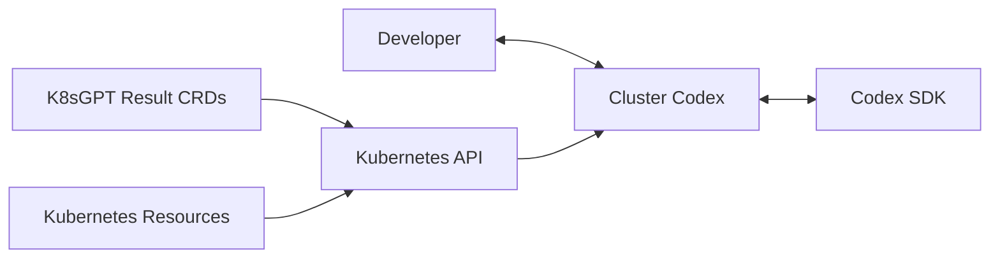

# Cluster Codex

**Your local-first Kubernetes troubleshooting workspace.**

## The Problem

Kubernetes troubleshooting is still high-friction. When workloads fail, teams often bounce between `kubectl`, events, logs, and tribal knowledge to diagnose and recover.

## The Solution

Cluster Codex is a single Next.js application that runs locally against your existing cluster access. This results in:

- No separate backend service to deploy
- Codex auth/provider mode is fully environment-driven via `.env`

The app assumes you already have a valid `kubeconfig` and permissions. Kubernetes access is handled inside the app using [`@kubernetes/client-node`](https://github.com/kubernetes-client/javascript), so your own kubeconfig context and RBAC remain the source of truth.

## How It Works


```mermaid
graph LR
    User[Developer]
    UI[Cluster Codex]
    Codex[Codex SDK]
    Cluster[Kubernetes API]
    K8sGPT[K8sGPT Result CRDs]
    Resources[Kubernetes Resources]

    User <--> UI
    UI <--> Codex
    Cluster --> UI
    K8sGPT --> Cluster
    Resources --> Cluster
```

1. Start your cluster and ensure K8sGPT is producing `Result` CRDs.
2. Run Cluster Codex.
3. The app reads cluster state using your kubeconfig.
4. Use the UI to inspect issues/resources and generate Codex remediation plans.

## Features

### Issues Dashboard

- Reads K8sGPT `Result` CRDs directly from Kubernetes APIs.
- Shows affected kind, namespace, name, severity, and detection time.
- Supports dismiss/restore with local browser storage.

### Live Codex Plan Generation

- Uses `@openai/codex-sdk` with structured JSON schema output for consistent plan shape.
- Generates comprehensive root-cause analysis, mitigation steps, validation checks, and rollback guidance.
- Falls back to deterministic local planning if Codex is unavailable.
- Supports auth modes via env (`chatgpt`, `api`, `auto`).
- Supports local providers (for example Ollama or llama-server) via env configuration.

### Resource Explorer

Read-only cluster inventory across common resource kinds:

- Pods, Deployments, DaemonSets, StatefulSets, ReplicaSets
- Jobs, CronJobs, Services, Ingresses, Namespaces
- ConfigMaps, Secrets, ServiceAccounts
- PersistentVolumes, PersistentVolumeClaims, CRDs, Nodes, Events

## Technology Stack

| Technology                                                                      | Purpose                                              |
| ------------------------------------------------------------------------------- | ---------------------------------------------------- |
| [Next.js](https://nextjs.org) + [React](https://react.dev)                      | Frontend UI + in-app route handlers                  |
| [Kubernetes Client JavaScript](https://github.com/kubernetes-client/javascript) | Kubernetes API access via kubeconfig                 |
| [Codex SDK](https://developers.openai.com/codex/sdk)                            | Live cluster issue analysis and remediation planning |
| [K8sGPT Operator](https://docs.k8sgpt.ai/getting-started/in-cluster-operator/)  | In-cluster issue detection                           |
| [K3d](https://k3d.io/stable)                                                    | Local Kubernetes cluster                             |
| [Playwright](https://playwright.dev)                                            | E2E testing                                          |

## Quick Start

```bash
# Prerequisites: Node.js 20+, Docker Engine, K3d, Helm, kubectl

git clone https://github.com/justinthelaw/clustercodex.git
cd clustercodex
npm install
# If your npm config omits optional deps, run:
npm install --include=optional

# `.env.example` sets auth mode to ChatGPT OAuth. Sign in once:
npx codex login --device-auth

# Setup example cluster and run app
npm run dev

# Open http://localhost:3000
```

See [DEVELOPMENT.md](DEVELOPMENT.md) for the full workflow.

### Troubleshooting: Missing Codex CLI Binaries

If plan generation fails with:
`Unable to locate Codex CLI binaries. Ensure @openai/codex is installed with optional dependencies.`

reinstall optional dependencies and retry:

```bash
npm install --include=optional
# or
npm install @openai/codex --include=optional
```

If needed, enable optional dependencies for this project:

```bash
npm config set include optional
```

## Codex Runtime Configuration

Cluster Codex reads Codex auth/provider behavior from environment variables.
There are no code-level defaults for Codex runtime envs; copy `.env.example` and edit values:

```bash
# Provided in `.env.example`
CODEX_MODEL=gpt-5.3-codex
CODEX_AUTH_MODE=chatgpt
# Optional: fail stalled generations, cap absolute runtime, and trim oversized context input
# CODEX_PLAN_IDLE_TIMEOUT_MS=90000
# CODEX_PLAN_MAX_TIMEOUT_MS=300000
# CODEX_PLAN_CONTEXT_MAX_CHARS=12000

# API key mode
CODEX_AUTH_MODE=api
CODEX_API_KEY=sk-...

# Auto mode (use API key if present, otherwise OAuth)
CODEX_AUTH_MODE=auto
```

Local provider examples:

```bash
# Ollama
CODEX_LOCAL_PROVIDER=ollama
CODEX_LOCAL_BASE_URL=http://localhost:11434/v1
CODEX_LOCAL_PROVIDER_ID=ollama
CODEX_LOCAL_PROVIDER_NAME=Ollama
CODEX_LOCAL_ENV_KEY=OPENAI_API_KEY
CODEX_MODEL=<your-local-model-name>

# llama-server (llama.cpp)
CODEX_LOCAL_PROVIDER=llama-server
CODEX_LOCAL_BASE_URL=http://localhost:8080/v1
CODEX_LOCAL_PROVIDER_ID=llama_server
CODEX_LOCAL_PROVIDER_NAME=llama-server
CODEX_LOCAL_ENV_KEY=OPENAI_API_KEY
CODEX_MODEL=<your-local-model-name>
```

## Project Structure

```text
clustercodex/
├── src/               # Next.js application source (root frontend + in-app APIs)
├── tests/             # Playwright end-to-end tests
├── scripts/           # Infrastructure orchestration and E2E runner
├── charts/            # Helm/YAML cluster assets
├── DEVELOPMENT.md     # Local development guide
└── README.md          # This file
```

## Validation

```bash
npm run flight-check
```

`flight-check` runs clean, lint, build, and E2E test workflows with bootstrapping.

## Contributing

See [docs/CONTRIBUTING.md](docs/CONTRIBUTING.md).

## Security

See [docs/SECURITY.md](docs/SECURITY.md).

## Support

See [docs/SUPPORT.md](docs/SUPPORT.md).

## License

This repository currently has no dedicated license file. Add one before broad reuse.
