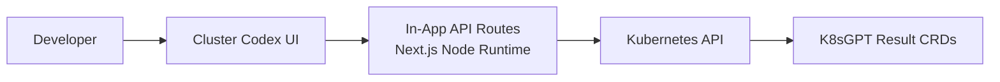

# Cluster Codex

**Your local-first Kubernetes troubleshooting workspace.**

## The Problem

Kubernetes troubleshooting is still high-friction. When workloads fail, teams often bounce between
`kubectl`, events, logs, and tribal knowledge to diagnose and recover.

## The Solution

Cluster Codex is a single Next.js application that runs locally against your existing cluster access.
There is:

- No separate backend service to deploy
- No app-level authentication
- No API tokens stored by this app

The app assumes you already have a valid `kubeconfig` and permissions. Kubernetes access is handled
inside the app using [`@kubernetes/client-node`](https://github.com/kubernetes-client/javascript),
so your own kubeconfig context and RBAC remain the source of truth.

## How It Works


```mermaid
graph LR
    User[Developer]
    UI[Cluster Codex UI]
    InApp[In-App API Routes\nNext.js Node Runtime]
    Cluster[Kubernetes API]
    K8sGPT[K8sGPT Result CRDs]

    User --> UI
    UI --> InApp
    InApp --> Cluster
    Cluster --> K8sGPT
```

1. Start your cluster and ensure K8sGPT is producing `Result` CRDs.
2. Run Cluster Codex.
3. The app reads cluster state using your kubeconfig.
4. Use the UI to inspect issues/resources and generate local remediation plans.

## Features

### Issues Dashboard

- Reads K8sGPT `Result` CRDs directly from Kubernetes APIs.
- Shows affected kind, namespace, name, severity, and detection time.
- Supports dismiss/restore with local browser storage.

### Local Plan Generation

- Generates deterministic troubleshooting plans in the browser.
- Includes quick-fix steps, validation checks, fallback guidance, and longer-term recommendations.
- No external LLM dependency.

### Resource Explorer

Read-only cluster inventory across common resource kinds:

- Pods, Deployments, DaemonSets, StatefulSets, ReplicaSets
- Jobs, CronJobs, Services, Ingresses, Namespaces
- ConfigMaps, Secrets, ServiceAccounts
- PersistentVolumes, PersistentVolumeClaims, CRDs, Nodes, Events

## Technology Stack

| Technology | Purpose |
| --- | --- |
| [Next.js](https://nextjs.org) + [React](https://react.dev) | Frontend UI + in-app route handlers |
| [Kubernetes Client JavaScript](https://github.com/kubernetes-client/javascript) | Kubernetes API access via kubeconfig |
| [K8sGPT Operator](https://docs.k8sgpt.ai/getting-started/in-cluster-operator/) | In-cluster issue detection |
| [K3d](https://k3d.io/stable) | Local Kubernetes cluster |
| [Playwright](https://playwright.dev) | E2E testing |

## Quick Start

```bash
# Prerequisites: Node.js 20+, Docker Engine, K3d, Helm, kubectl

git clone https://github.com/justinthelaw/clustercodex.git
cd clustercodex
npm install
cp .env.example .env.local

# Terminal 1: create local infra (k3d + K8sGPT + sample workloads)
npm run infra:start

# Terminal 2: run app
npm run dev

# Open http://localhost:3000
```

See [DEVELOPMENT.md](DEVELOPMENT.md) for the full workflow.

## Project Structure

```text
clustercodex/
├── src/               # Next.js application source (root frontend + in-app APIs)
├── tests/             # Playwright end-to-end tests
├── scripts/           # Infrastructure orchestration and E2E runner
├── charts/            # Helm/YAML cluster assets
├── DEVELOPMENT.md     # Local development guide
└── README.md          # This file
```

## Validation

```bash
npm run flight-check
```

`flight-check` runs clean, lint, build, and E2E test workflows with bootstrapping.

## Contributing

See [docs/CONTRIBUTING.md](docs/CONTRIBUTING.md).

## Security

See [docs/SECURITY.md](docs/SECURITY.md).

## Support

See [docs/SUPPORT.md](docs/SUPPORT.md).

## License

This repository currently has no dedicated license file. Add one before broad reuse.
